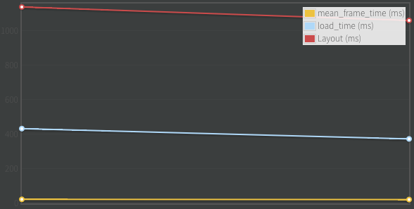

Topcoat is built with performance in mind and for that we are striving to benchmark everything. If you visit [bench.topcoat.io](http://bench.topcoat.io) you will see the components from our latest release and their benchmark over time.

The goal of the website is to have publicly accessible benchmark results for our users and for us to spot regressions and performance issues.

###### Key metrics
 * Mean frame time (Frame time) - not frames per second (FPS) this is actually a more accurate rating of performance, a good article with an in depth explanation: [fps versus frame time](http://www.mvps.org/directx/articles/fps_versus_frame_time.htm)

 * Load time

 * Layout time
 
 

The server can also be used offline for components development. You can make changes to a component, say for example swap box-shadow for for a dark border with reduced opacity, the plots can offer you a nicer visualisation of the performance impact.

There is a [screencast](http://www.youtube.com/watch?v=Mhw4Sf1WWwQ) where you can see how to get started with using it for your own needs.

<iframe class="video" src="//www.youtube.com/embed/Mhw4Sf1WWwQ" frameborder="0" allowfullscreen></iframe>

## How

We are using [Chromium Telemetry](http://www.chromium.org/developers/telemetry). Telemetry is a python powered framework used for cross-(chrome)-platform performance testing. It abstracts launching, connecting, and opening a page and records the metrics mentioned above and many others.

We have a Grunt task that takes results and pushes them to the server.

The server is written in Node and uses [http://www.flotcharts.org/](http://www.flotcharts.org/) to display the results.

## Usage guide

1. [chromium.org/developers/how-tos/get-the-code](http://www.chromium.org/developers/how-tos/get-the-code) offers step by step instructions on how to download Chromium. You will need it entirely if you want to run Telemetry so be ready for a ~1.6GB download.
2. In `chromium/src/tools/perf/page_sets` you will find ***.json** files which are required as input when running the telemetry tests. There is a specific boilerplate json that you will need to write in order to tell Telemetry where the page you want to benchmark is located.
3. To run Telemetry you will need to be in `chromium/src/tools/perf`. The command is
	`./run_multipage_benchmarks --browser=system loading_benchmark page_sets/topcoat_buttons-base.test.json -o /tmp/loading_benchmark_topcoat_buttons-base.txt`
	* **loading_benchmark** parameter tells Telemetry to record load time, layout time, the time it took to parse the HTML etc.
	* **smoothness_benchmark** parameter tells Telemetry to scroll the page while recording, this time it captures mean frame time, jank count and many others.
4. After you have the data you can use the Grunt task in the Topcoat repo to parse the files that have specified as output and submit them to your clone of Topcoat Server running locally.
All of these steps are also shown in the [screencast](http://www.youtube.com/watch?v=Mhw4Sf1WWwQ).

If there are any questions you can use the comments below, I'm looking forward to seeing pull requests/issues reporting for the project. You can also hit me up on twitter [@ndreio](http://twitter.com/ndreio)

Useful links:

* main home page [http://topcoat.io](http://topcoat.io)
* github repository [https://github.com/topcoat/](https://github.com/topcoat/)
* Topcoat Server [https://github.com/topcoat/topcoat-server](https://github.com/topcoat/topcoat-server)
* more about Chromium Telemetry [http://www.chromium.org/developers/telemetry](http://www.chromium.org/developers/telemetry)