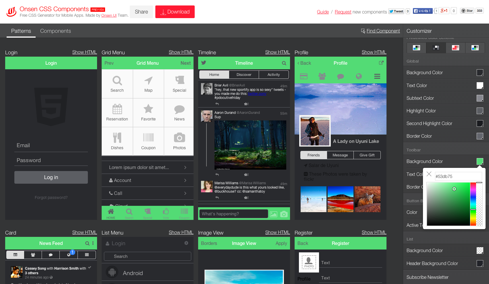

Topcoat CSS is great for many reasons, notably mobile UI performance. It is also extremely customizable which is excellent. But you do have to go through downloading the source code, installing dependencies, modifying variables, and starting the build process. That's a lot of stuff to do.

We want to make it easier. Introducing [Onsen CSS Components](http://components.onsenui.io)!

Onsen CSS Components is aimed at hybrid app developers and web app developers who want to quickly create beautiful UI. It has a growing selection of UI patterns which can be easily customized via a web interface. Because it is just CSS, you can use it with any JS framework.

### How to use

#### Theme roller

Just go to [components.onsenui.io](http://components.onsenui.io). On the right is a color palette with some predefined color sets. You can adjust color variables the way you like.

 

On the left you can see the UI reflect the color you choose.

After you are done, you can download the CSS components to use with your project… or share your creative work with the world!

The downloaded zib has the following files:

- demo.html : example code
- onsen\_css\_component.css : css file
- patterns : contains all patterns html and css
- LICENSE : License

To use the css, copy **onsen\_css\_component.css** file to your project directory, and reference it in your index.html.

	<html>
	<head>
		<link rel="stylesheet" type="text/css" href="onsen_css_component.css">
	</head>
	<body>
		
	</body>
	</html>

Checkout **demo.html** and **patterns** folder for more examples.

Click on a component will show its markup and CSS code.

#### UI Patterns

In the **Overview** panel, you can scroll through collections of beautiful UI patterns. This is not just eye candy; you can inspect the source code. We make it easy to copy and past the code to your project. We will keep adding more patterns. If you cannot find a pattern you want, you can request one by clicking the **Request** button; or you can contribute your own pattern via the **Register** button.

### Conclusion

With Onsen CSS Components, we hope we can make your life as a developer easier with this growing collection of UI patterns that is easily customizable. It’s a great place to start. Why not give it a try?

[Onsen CSS Components](http://components.onsenui.io)
