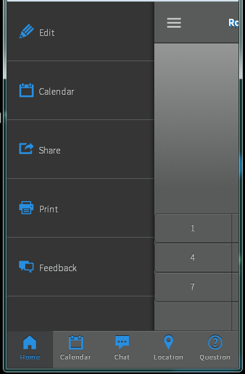

 
### Where to start...
When developing mobile applications, one of the main considerations has to be around **performance**.  And as you know, one of the largest drains on application performance is the quantity and size of the images used within your app. So...

*How do you ensure your application is still aesthetically pleasing without compromising on performance?*

### One possible solution
One way to improve the performance of your application is to use *font icons* instead of icon images or sprites.  Font icons are generally lighter weight than sprite images, plus they are easily updated and require very little CSS updates.  In fact, you can update font icons the same way you would update the font using the *font-size* and *color* attributes. 

Below is some basic steps you can take to get font icons working in your project using the Topcoat icons.  So let's get started. 
 
### Creating font icons
Out of the box, the [Topcoat Icons GitHub Repository](https://github.com/topcoat/icons) has the necessary files you need to get started with all the available icons as of v0.8.0.  See the */font* folder.  

As we're also focusing on performance, this post shall detail the steps required to create and use your *own* custom icon font to achieve the results shown in the images below.

In order to create your own custom icon web font you can use an online application called [Icomatic](http://www.icomatic.io/).  There are other tools available for you to experiment with but for now Icomatic is the weapon of choice. 

* If you've not done so already, clone / download the [Topcoat icons](https://github.com/topcoat/icons) repo from GitHub
* Then fire up a browser and go to [Icomatic](http://www.icomatic.io/)
* Select "Try the app" button on the homepage
* Select "Upload files..."
* Navigate to your local copy of the Topcoat Icons repository and select the icon files you need from the *\svg* folder 
* Amend the icon labels as required.  This is optional
* Finally click on "Download Kit"

[Icomatic](http://www.icomatic.io/) will generate the font files you need (*eot, ttf, woff, and svg*).  You can include each or all of these at your own discretion.  

The benefit of this is that you can include only the icons you need for your project so you can generate bespoke font files on a per project basis.

### The styles 
Download and Extract these files into the appropriate location for your project.  

My *icomatic.css* file is located in the */css* folder of my project along with the font files but you can place them wherever you prefer as long as the paths to the font files are correct otherwise it won't work correctly and you'll just see the text equivalent of the icon label that you're trying to display.

Below is an example of the CSS content from my *icomatic.css* file:

The font family "*SourceSansPro-Light*" is just a backup that I'm using that is also supplied with Topcoat.  It is the first open source font family contribution from Adobe and is served on [Adobe Edge Web Fonts](https://edgewebfonts.adobe.com/fonts#/?nameFilter=source&collection=source-sans-pro) and [Adobe Typekit](https://typekit.com/fonts/source-sans-pro).  

**Note:** "*SourceSansPro-Light*" is a regular text font and does not support icons.

### The mark-up
Next here comes the sweet part of using an icon font. 

I have some mark-up to display a tab-bar that contains five buttons, each with an icon and some text below (see result images below).

Any element with the *.icomatic* class will apply the icomatic font family, as per the previous CSS, which in turn will display your icon (*as long as the icon label text you have supplied within the mark-up matches that in the font file*).

To change the icon size and color you simply specify the CSS *font-size* and *color* attribute.
There is a great [example](http://icomatic.github.io/sample-set/kit/icomatic.html) of this on the Icomatic site which allows you to experiment with the icon size and colour using the controls located at the top-right corner.

### The result
####Topcoat Tab Bar with Button Icons
  
####Topcoat Sidebar with Icons

### One additional benefit
If that wasn't good enough, how would you like to add some depth / shadow to your icons...for free?  Well it's as simple as applying the CSS *text-shadow* attribute, as you would in...you guessed it, a font like so:

<pre><code>text-shadow : 0 -1px rgba(0, 0, 0, 0.69);</code></pre>

This effect has also been applied to my icons in the images above.  All without the need to update any images / sprites.

### What about sprite images?
Sprite images are still an option although I preferred not to have to specify a CSS rule and image position for every icon I wanted to use, even if I was using a sprite creation tool.

I also didn't want to have to compile a custom sprite image to only include the icons being used in my application.  Out of the box, font icons seemed to be the most efficient option.

### Summary of resources
* [Topcoat](http://topcoat.io)
* [Topcoat Icons](https://github.com/topcoat/icons)
* [Icomatic](http://icomatic.io)
* [Icomatic Demo](http://icomatic.github.io/sample-set/kit/icomatic.html)

If there is enough interest I am happy to supply a screen-cast of this process, so please mention this in the comments if it's something you would find helpful. 

> Kindly brought to you by [Niall O'Doherty](http://www.twitter.com/nodoherty) - [@nodoherty](http://www.twitter.com/nodoherty).
> Errors and omissions excepted

